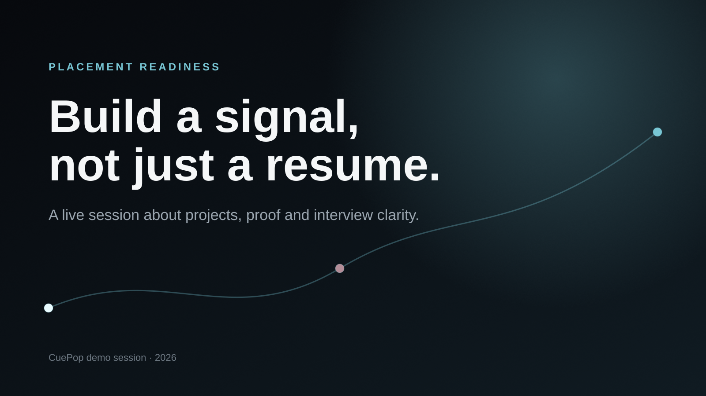

# Deckactive

A production-shaped, locally runnable MVP for image-first live presentations. Deckactive turns uploaded slide images into a synchronized room experience with QR joining, polls, quizzes, presenter-controlled reveals, a projector-safe stage, phone remote, reports, and attendee keepsake cards.



## Run locally

Requirements: Node.js 20.9 or newer and npm 10 or newer. Node.js 22 LTS is recommended.

```bash
npm install
npm run dev
```

Open `http://localhost:3000`.

### Demo account

```text
Email: demo@cuepop.app
Password: demo1234
```

The first run creates `data/cuepop.db`, seeds the demo user and a mixed slide/poll/quiz deck, and creates `data/uploads`.

## Test the complete flow

1. Sign in with the demo account.
2. Open **Placement Readiness Live**.
3. Upload a slide or insert a poll/quiz.
4. Select **Start live session**.
5. Open the projector stage from the presenter console.
6. Open the attendee link or scan the QR code.
7. Open the phone remote link in another browser or on a phone.
8. Start the first item, advance to a question, open voting, submit an attendee answer, close and reveal.
9. End the session and download the attendee keepsake.
10. Open the presenter report and export CSV.

## QR testing on a phone

A phone cannot reach your computer through `localhost`. Put both devices on the same network, find the computer's LAN address, and open Deckactive through that address, for example:

```text
http://192.168.1.24:3000
```

Start the session from that URL. Deckactive generates the QR code from the browser origin, so the phone receives a reachable LAN join link. Windows Firewall may ask permission for Node.js to accept private-network connections.

For a deployed environment, set:

```bash
NEXT_PUBLIC_APP_URL=https://cuepop.example.com
```

## Scripts

```bash
npm run dev        # Next.js + Socket.IO with file watching
npm run build      # production Next.js build
npm run start      # production custom Node server
npm test           # Vitest domain tests
npm run typecheck  # TypeScript verification
npm run lint       # ESLint
npm run check      # lint + typecheck + tests + production build
```

A basic health endpoint is available at `GET /api/health`.

## Architecture

```text
Browser surfaces
├── Marketing landing page
├── Host workspace / deck builder
├── Presenter console
├── Projector stage
├── Attendee mobile page
└── Phone remote
       │
       ├── Next.js Route Handlers (auth, deck CRUD, upload, report)
       └── Socket.IO events (join, vote, host command, room snapshot)
              │
              └── SQLite repository + authoritative live-room service
```

The custom server in `server.ts` hosts Next.js and attaches Socket.IO to the same HTTP server. `src/lib/live/service.ts` is the authoritative state machine. Browser clients never decide whether a vote or presenter command is valid.

### Room states

```text
join → presenting → active → closed → revealed → ended
```

- `join`: dynamic QR screen and waiting message
- `presenting`: slide or question preview is visible
- `active`: voting is accepted
- `closed`: voting is rejected, results remain hidden
- `revealed`: aggregate results are public
- `ended`: attendee keepsake flow is available

## Privacy and reliability behavior

- Attendees do not need accounts.
- Names are optional and never included in stage snapshots or aggregate report responses.
- Presenter and phone remote commands require a random controller token.
- Passwords are hashed with bcrypt.
- Every attendee has a device identity stored locally in the browser.
- The server enforces one response per attendee per item.
- Existing attendees can reconnect even after joining is locked.
- Rejoining restores whether the attendee already answered the active item.
- Uploads accept PNG, JPEG, WebP and GIF up to 10 MB and verify file signatures.
- Host-selected keepsake themes are the only designs attendees can choose after the session.

## Plans and limits

The seeded demo account uses the `pro` plan and permits up to 500 attendees per room. Newly registered local accounts use the free plan:

- 3 live sessions per calendar month
- 50 attendees per room

These limits demonstrate the commercial enforcement boundary. There is no fake payment form. Connect a real payment provider before selling access.

## Design system

The marketing site follows a cinematic, restrained dark direction inspired by high-end developer tooling sites: true-black negative space, editorial headings, matte product surfaces, ice-cyan highlights, limited violet/warm reflections, and product-derived artwork. The application workspace uses quieter shadcn-style primitives. Motion is implemented with Framer Motion following beUI's copy-paste, reduced-motion-safe philosophy.

The visual package includes editable SVG artwork and generated high-resolution PNG source renders under `public/art`:

- `signal-path.svg` and `renders/signal-path.png`
- `three-surfaces.svg` and `renders/three-surfaces.png`
- `auditorium.svg` and `renders/auditorium.png`
- `demo-slide-1.svg` and `renders/demo-slide-1.png`
- `demo-slide-2.svg` and `renders/demo-slide-2.png`

## Production deployment

The included runtime is intended to work immediately on a laptop or a persistent Node host. Because it uses a custom Socket.IO server and local SQLite/files, deploy it to a persistent Node/Docker platform such as Fly.io, Railway, Render, a VPS, or Kubernetes.

```bash
docker build -t cuepop .
docker run --rm -p 3000:3000 -v cuepop-data:/app/data cuepop
```

A serverless Vercel deployment is not appropriate for this exact local adapter because serverless functions do not provide a persistent Socket.IO process or writable durable disk. To deploy on Vercel, replace:

- SQLite with hosted Postgres
- local uploads with object storage
- Socket.IO with a hosted realtime service

The UI and domain contracts are intentionally separated so those adapters can be changed without redesigning the product.

## Before a real 500-person event

The code enforces a 500-attendee pro cap, but a numerical cap is not proof of capacity. Before commercial launch:

- run a 500-client load test against the actual deployment topology
- add Redis or another shared realtime coordinator when running multiple app instances
- add structured logs, metrics, tracing and alerting
- use hosted Postgres and object storage with backups
- add rate limiting at the edge and socket event level
- add transactional email and password recovery
- complete browser/device acceptance tests
- perform security and privacy review

## Project documents

- Product state: `.planning/PROJECT.md`
- Roadmap: `.planning/ROADMAP.md`
- Design spec: `docs/superpowers/specs/2026-07-26-cuepop-live-mvp-design.md`
- Implementation plan: `docs/superpowers/plans/2026-07-26-cuepop-live-mvp.md`
- Verification record: `VERIFICATION.md`

## Synthetic room load test

Start a pro room, advance to a poll and open voting. In another terminal run:

```bash
ROOM_CODE=K8M4Q2 CLIENTS=500 npm run load:test
```

The script opens Socket.IO clients, joins each with a unique device identity and submits a vote when the current room state is active. Run this against the same deployment topology intended for the event and monitor latency, CPU, memory, database locking and delivery errors.
